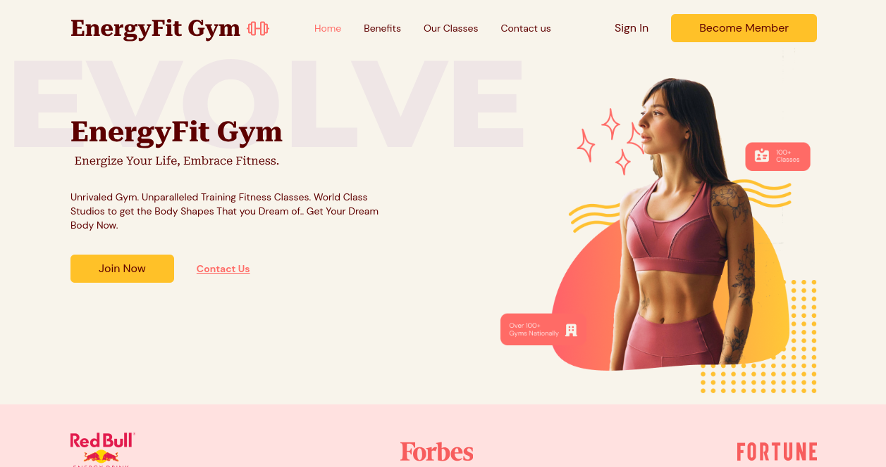
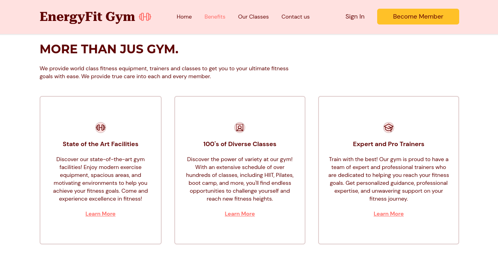

# BeMAKER LAB-WebSite
#### WebSite OnePage desenvolvido com a finalidade de aprimorar o dominío sobre o Front-End React + TypeScript.

### Tecnoligias utilizadas no projeto:
 * ReactJs(Vite)
 * Tailwindcss
 * HTML5
 * react-hook-form

### Passo-a-passo para rodar a aplicação:

1. Entre na BeMAKER LAB;
2. Use o comando: ***yarn*** ou ***npm install/i*** para instalar os pacotes;
3. Use o comando: ***yarn dev*** ou ***npm run dev*** para rodar a aplicação;
4. Edite o modelo base como julgar melhor.